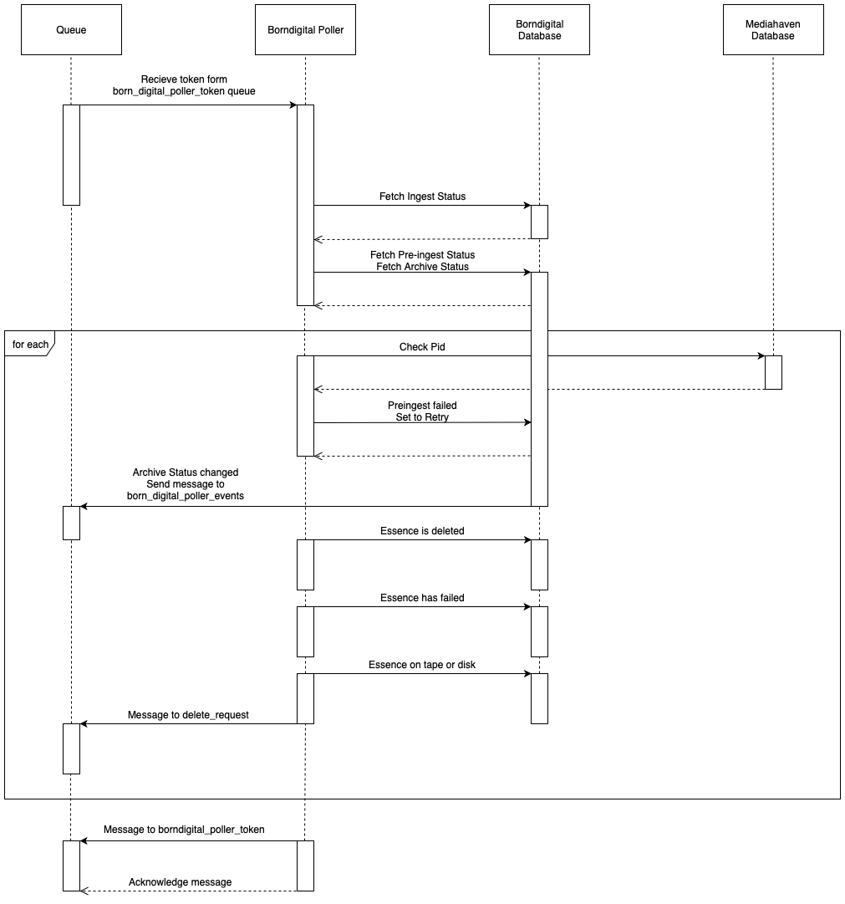

# Borndigital Poller

## Synopsis

Borndigital Poller responsability is deleting items on the ingest FTP-server.
It checks the archive_status of all items in VIAA’s SIP’s table. Borndigital
stores items in VIAA’s SIP’s table which Borndigital-Poller then queries to see
which items it needs to check against MaM.

## Description

The Borndigital Poller receives a token from the `borndigital_poller_token`
queue and checks the `ingest_status` in the borndigital database. When the
`pre-ingest_status` is OK, the PID is searched in Mediahaven.  If the data does
not yet exist and has been added to the database, the Pid ID will be checked in
Mediahaven.  If the PID is found, the archive status is checked. If the archive
status has changed, a message will be sent to the `borndigital_poller_events`
queue.  The status of the essence is then checked; has it been archived on tape
or disk, has it been deleted or has it failed?  If it is successfully archived
on tape or disk, the essence will be deleted and a message will be sent to the
`borndigital_poller_token` queue so it can restart the flow.

## Diagram



## Technical

|Role              | Handle / username|
| -------------    |--------------| 
|Principal/Owner   | [@RudolfDG](https://github.com/RudolfDG) | 
|Wing(wo)man       | [@maartends](https://github.com/maartends) |


## Stack

#### Backend
- Mule Community Edition ESB


## Logging and monitoring

#### Backend
- /opt/mule/mule-CURRENT/logs/mule-${sys:domain}.log


## Deployment/Installation

#### Prerequisites
- Mule Community Edition ESB
- Add the necessary values in `staging.yaml.example` and rename the file to `production`- or `staging.yaml` .

#### Backend

- Export .zip file from Anypoint Studio.
- cd to the folder where your .zip file is stored.
- Use a script to deploy app
*Example script:*

```bash
#!/bin/bash
ZIPFILE=$1
SERVER=$2
DEPLOYPATH="/opt/mule-ce-standalone-3.9.0/apps/"
USERNAME="mule"

if [ ! -f $ZIPFILE ]; then
        echo "$ZIPFILE does not exist! Exiting"
        exit 1
fi

echo "Deploying Zipfile: $ZIPFILE to Server: $SERVER"

scp $ZIPFILE $USERNAME@$SERVER:$DEPLOYPATH
```


- To deploy use the command: `./nameOfScript.sh` (example: ./deployMuleApplication.sh).
- If you get the message: `Deploying Zipfile: nameOfZipFile.zip to Server: do-qas-esb-01.do.viaa.be`, you succesfully deployed the file.
- If you get the message: `nameOfZipFile.zip does not exist! Exiting`, something went wrong.
- Enter your password.


## Usage

#### Examples
The flow can be started via messages on the `borndigital_poller_token queue`

### Troubleshooting

If, for some reason, a message does not get acked (and, thus, the poller-flow halts):

- undeploy application (remove anchor file)
- delete message (or purge queue)
- redeploy application (see "Deployment")
- publish message on queue.


